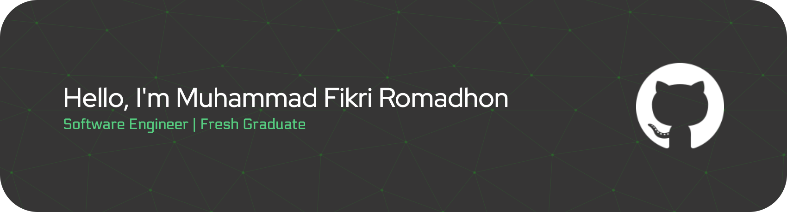

### Software Engineer Enthusiast

---

## About Me

- Informatics Graduate from Universitas Pamulang
- Interested in Software Engineering, Backend Development, and Mobile Development
- Currently learning Docker, REST API, Clean Architecture, and Cloud Computing
- Love solving problems and building useful applications

---

## Tech Stack

**Languages**

**Frameworks & Tools**

---

## Featured Projects

#### AES + LSB Steganography Desktop App

Desktop application that combines **AES Encryption** and **LSB Steganography** to secure confidential messages inside digital images.

`Python` `Tkinter` `Pillow` `Cryptography`

---

#### Flutter Food Ordering App

Food ordering application built with Flutter and integrated with REST API.

`Flutter` `Dart` `REST API`

---

#### Decision Support System

Desktop application to assist decision making based on multiple criteria.

`Python`

---

#### MyTsel UI Clone

Flutter implementation of the MyTelkomsel user interface.

`Flutter`

---

## Currently Learning

- Backend Development
- Docker
- PostgreSQL
- Cloud Computing

---

## Connect With Me

---

> _"Keep learning, keep building, and never stop improving."_

  

 

